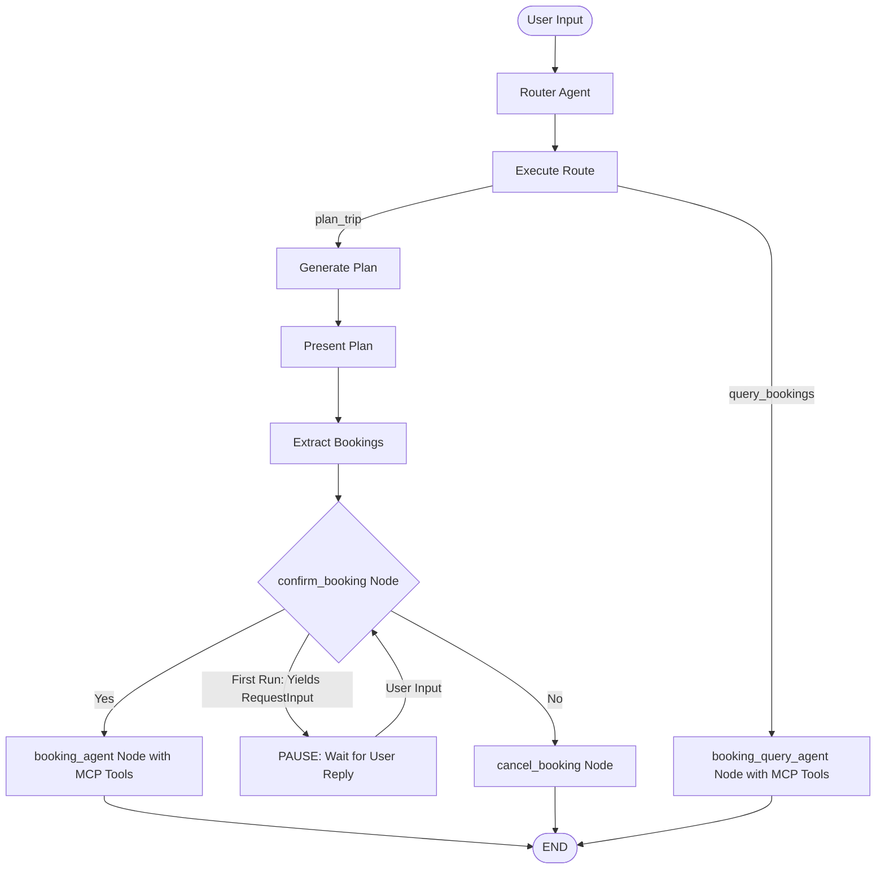

# Agentic Trip Planner

A starter Python application using the Google Agent Development Kit (ADK) that generates a trip plan, followed by a human-in-the-loop booking confirmation and execution using a simulated MCP server.

## Project Structure

*   `trip_planner/`: The core agent package. Contains the agent definitions and workflow configuration.
    *   `agent.py`: Defines the trip planner workflow, including the generator agent, the booking extraction/execution agents, and the confirmation flow.
    *   `mcp_server.py`: A simulated booking service (MCP server) that exposes tools to book hotels and activities.
    *   `bookings.json.example`: Template for sample bookings data.
    *   `.env.example`: Template for environment variables (API keys) used by the ADK CLI.
*   `main.py`: A local programmatic test harness to run the workflow in the terminal, handling interrupts and responses.
*   `requirements.txt`: Python dependencies.
*   `.env.example`: Root-level template for environment variables used by `main.py`.

## Prerequisites

If you are running this on a clean gLinux/Cloudtop machine, you may need to install `pip` and the `venv` module first:

```bash
sudo apt update
sudo apt install python3-pip python3-venv
```

## Setup Instructions

1.  **Create and activate a virtual environment**:
    ```bash
    python3 -m venv .venv
    source .venv/bin/activate
    ```

2.  **Install dependencies**:
    ```bash
    pip install -r requirements.txt
    ```

3.  **Configure Environment Variables**:
    You need a Gemini API key from [Google AI Studio](https://aistudio.google.com/app/apikey).
    
    *   **For running with ADK CLI (Recommended)**:
        Copy the example env file inside the agent folder and add your key:
        ```bash
        cp trip_planner/.env.example trip_planner/.env
        ```
    *   **For running programmatically (`main.py`)**:
        Copy the root example env file and add your key:
        ```bash
        cp .env.example .env
        ```
    
    Open the created `.env` file and replace `your_gemini_api_key_here` with your actual API key:
    ```env
    GOOGLE_API_KEY=AIzaSy...
    ```

4.  **Optionally pre-populate bookings for testing (Optional)**:
    If you want to test the "show my bookings" feature without running a full planning cycle first, you can pre-populate the database with sample bookings:
    ```bash
    cp trip_planner/bookings.json.example trip_planner/bookings.json
    ```

## How to Run the Agent

### Method 1: Using ADK CLI (Recommended & Production Consistent)

This is the recommended way to test the agent locally as it mirrors how the agent is loaded in a production environment (like Vertex AI Reasoning Engine).

Ensure your virtual environment is active, then run:
```bash
adk run trip_planner
```
This will start an interactive chat session in your terminal. Type `exit` to quit.

### Method 2: Programmatically (`main.py`)

If you want to run the agent using a custom Python script (useful for automated testing or integration into a larger application):

Ensure your virtual environment is active, then run:
```bash
python main.py
```

## Workflow Diagram



## Infrastructure Deployment (Terraform)

This project contains a Terraform configuration to package and deploy the agent to Google Cloud Platform as a **Vertex AI Reasoning Engine** (Vertex Custom Agent).

### What gets deployed:
1. **APIs Enabled**: Vertex AI (`aiplatform`), Cloud Storage (`storage`), and Secret Manager (`secretmanager`).
2. **Cloud Storage Bucket**: Stores the serialized agent engine and dependency source packages.
3. **Service Account**: Creates `reasoning-engine-test-sa` with restricted IAM permissions (Logging, Storage, Vertex AI Model access).
4. **Secret Manager API Key Slot**: Creates a secret container named `gemini-api-key` and allows the Service Account to read it.
5. **Vertex AI Reasoning Engine**: The hosted runtime executing your workflow.

---

### How to Deploy

#### 1. Compile and Package the Agent
Before deploying, you must serialize the agent and package its dependencies. From the root directory, run:
```bash
./build_assets.sh
```
This generates the binary assets `agent_engine.pkl` and `dependencies.tar.gz` in `terraform/files/` (these are ignored by Git).

#### 2. Configure project variables
Create a `terraform/terraform.tfvars` file to specify your target GCP project:
```hcl
project_id = "your-gcp-project-id"
location   = "us-central1"
```

#### 3. Run Terraform
Run the deployment commands:
```bash
cd terraform
terraform init
terraform plan
terraform apply
```

#### 4. Populate your API Key in Secret Manager
For security, Terraform creates the Secret Manager container but does **not** set the API key value. 

You must manually upload your Gemini API key to the secret. You can do this easily via the terminal (assuming you have your key in the root `.env` file):
```bash
# Extract the key from your local .env and add it to Secret Manager
grep GOOGLE_API_KEY ../.env | cut -d '=' -f2 | tr -d '\n' | gcloud secrets versions add gemini-api-key --data-file=-
```
*(Or upload it manually in the GCP Console under **Secret Manager** -> `gemini-api-key` -> **Add Version**).*

The Reasoning Engine runtime will automatically load this secret into the container environment as the `GOOGLE_API_KEY` environment variable.
