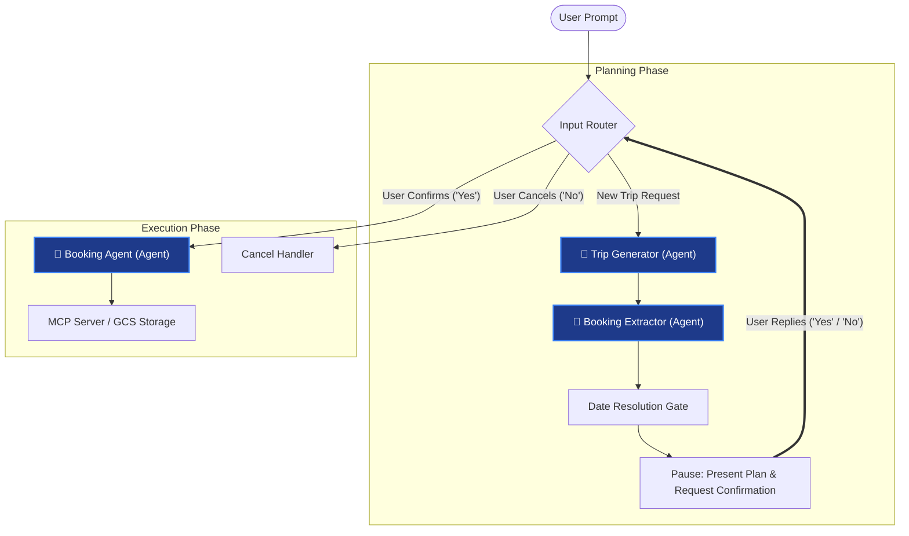

# Agentic Trip Planner

A starter Python application using the Google Agent Development Kit (ADK) that generates a trip plan, followed by a human-in-the-loop booking confirmation and execution using a simulated MCP server.

## Project Structure

*   `trip_planner/`: The core agent package. Contains the agent definitions and workflow configuration.
    *   `agent.py`: Defines the trip planner workflow, including the generator agent, the booking extraction/execution agents, and the confirmation flow.
    *   `mcp_server.py`: A simulated booking service (MCP server) that exposes tools to book hotels and activities.
    *   `bookings.json.example`: Template for sample bookings data.
    *   `.env.example`: Template for environment variables (API keys) used by the ADK CLI.
*   `main.py`: A local programmatic test harness to run the workflow in the terminal, handling interrupts and responses.
*   `requirements.txt`: Python dependencies.
*   `.env.example`: Root-level template for environment variables used by `main.py`.

## Prerequisites

If you are running this on a clean gLinux/Cloudtop machine, you may need to install `pip` and the `venv` module first:

```bash
sudo apt update
sudo apt install python3-pip python3-venv
```

## Setup Instructions

1.  **Create and activate a virtual environment**:
    ```bash
    python3 -m venv .venv
    source .venv/bin/activate
    ```

2.  **Install dependencies**:
    ```bash
    pip install -r requirements.txt
    ```

3.  **Configure Environment Variables**:
    You need a Gemini API key from [Google AI Studio](https://aistudio.google.com/app/apikey).
    
    *   **For running with ADK CLI (Recommended)**:
        Copy the example env file inside the agent folder and add your key:
        ```bash
        cp trip_planner/.env.example trip_planner/.env
        ```
    *   **For running programmatically (`main.py`)**:
        Copy the root example env file and add your key:
        ```bash
        cp .env.example .env
        ```
    
    Open the created `.env` file and replace `your_gemini_api_key_here` with your actual API key:
    ```env
    GOOGLE_API_KEY=AIzaSy...
    ```

4.  **Optionally pre-populate bookings for testing (Optional)**:
    If you want to test the "show my bookings" feature without running a full planning cycle first, you can pre-populate the database with sample bookings:
    ```bash
    cp trip_planner/bookings.json.example trip_planner/bookings.json
    ```

## How to Run the Agent

### Method 1: Using ADK CLI (Recommended & Production Consistent)

This is the recommended way to test the agent locally as it mirrors how the agent is loaded in a production environment (like Vertex AI Reasoning Engine).

Ensure your virtual environment is active, then run:
```bash
adk run trip_planner
```
This will start an interactive chat session in your terminal. Type `exit` to quit.

### Method 2: Programmatically (`main.py`)

If you want to run the agent using a custom Python script (useful for automated testing or integration into a larger application):

Ensure your virtual environment is active, then run:
```bash
python main.py
```

## Workflow Diagram



## Conversational State Machine

Instead of relying on platform-level interrupts (`RequestInput` yields) which require structured user payloads and break in text-only clients like the Google Cloud Console Agent Playground, this agent uses a **conversational state-machine pattern** backed by `ctx.state`.

### How it works:
1. **Turn Interception**: The workflow is structured with `input_router` as the root entry point. Every turn starts there.
2. **Active State Check**: If the session has an active request stored in `ctx.state.awaiting_input`, `input_router` parses the plain text message, updates the state with variables (e.g. `trip_start_date` or confirmation intents), clears the waiting status, and routes execution directly to the target node.
3. **Invalid Input Retry**: If the text input fails parsing or validation (e.g., date formats), the workflow prints a warning and returns to the user while keeping the state active.
4. **Suspending**: Nodes that require user interaction (like resolving relative dates or getting confirmation) output their prompt message, set `awaiting_input` in the state, and route to `suspend_workflow` which halts the current thread execution.


## Local Evaluation (ADK Eval Suite)

The project includes a regression suite using ADK's `AgentEvaluator` and the Vertex Gen AI Evaluation Service.

### 1. Install evaluation dependencies:
To run evaluations locally, you must install the `[eval]` extra package for `google-adk`:
```bash
.venv/bin/pip install "google-adk[eval]"
```

### 2. Run the evaluation suite:
Run the regression tests using the programmatic runner script:
```bash
.venv/bin/python run_eval.py
```
This executes the test cases defined in `trip_planner.evalset.json` against the criteria in `test_config.json`. 

By default, the regression suite validates:
*   **Trip Start Date Required**: Given a relative-day itinerary with no start date, the agent must return the templated date gate message and must **not** call any booking tools prematurely.
*   **Tool Trajectory Match**: Assures the exact sequence of tool calls aligns with expectations.
*   **Response ROUGE Score**: Assures the agent output text matches expected control-flow templates.


## Infrastructure Deployment (Terraform)

This project contains a Terraform configuration to package and deploy the agent to Google Cloud Platform as a **Vertex AI Reasoning Engine** (Vertex Custom Agent).

### What gets deployed:
1. **APIs Enabled**: Vertex AI (`aiplatform`), Cloud Storage (`storage`), and Secret Manager (`secretmanager`).
2. **Cloud Storage Bucket**: Stores the serialized agent engine and dependency source packages.
3. **Service Account**: Creates `reasoning-engine-test-sa` with restricted IAM permissions (Logging, Storage, Vertex AI Model access).
4. **Secret Manager API Key Slot**: Creates a secret container named `gemini-api-key` and allows the Service Account to read it.
5. **Vertex AI Reasoning Engine**: The hosted runtime executing your workflow.

---

### How to Deploy

#### 1. Compile and Package the Agent
Before deploying, you must serialize the agent and package its dependencies. From the root directory, run:
```bash
./build_assets.sh
```
This generates the binary assets `agent_engine.pkl` and `dependencies.tar.gz` in `terraform/files/` (these are ignored by Git).

#### 2. Configure project variables
Create a `terraform/terraform.tfvars` file to specify your target GCP project:
```hcl
project_id = "your-gcp-project-id"
location   = "us-central1"
```

#### 3. Run Terraform
Run the deployment commands:
```bash
cd terraform
terraform init
terraform plan
terraform apply
```

#### 4. Populate your API Key in Secret Manager
For security, Terraform creates the Secret Manager container but does **not** set the API key value. 

You must manually upload your Gemini API key to the secret. You can do this easily via the terminal (assuming you have your key in the root `.env` file):
```bash
# Extract the key from your local .env and add it to Secret Manager
grep GOOGLE_API_KEY ../.env | cut -d '=' -f2 | tr -d '\n' | gcloud secrets versions add gemini-api-key --data-file=-
```
*(Or upload it manually in the GCP Console under **Secret Manager** -> `gemini-api-key` -> **Add Version**).*

The Reasoning Engine runtime will automatically load this secret into the container environment as the `GOOGLE_API_KEY` environment variable.


## Observability (Cloud Trace)

The agent has Cloud Trace integration enabled. Telemetry flows automatically from the deployed Vertex AI Reasoning Engine to Google Cloud's operations suite.

### 1. Code Configuration:
Tracing is enabled during serialization in `build_assets.sh`:
```python
app = AdkApp(agent=root_agent, enable_tracing=True)
```

### 2. Infrastructure Setup (Terraform):
Terraform automatically handles:
*   Enabling the Cloud Trace API (`cloudtrace.googleapis.com`).
*   Granting the Cloud Trace Agent role (`roles/cloudtrace.agent`) to the Reasoning Engine's service account.

### 3. How to view traces:
*   **Agent Registry Panel:** Go to **Agent Platform** -> **Agent Registry** -> select your reasoning engine, and open the **Traces** tab to see step-by-step execution trees.
*   **Trace Explorer:** Go to **Cloud Trace** -> **Trace explorer** in the GCP Console to see end-to-end latency charts and execution timelines.

### 4. Spans and Data Captured by Tracing:
The ADK framework automatically emits hierarchical spans for each conversation turn:
*   **Root Spans (`agent.run` / `stream_query`)**: Captures the overall user request and the end-to-end latency.
*   **Node Spans (e.g. `trip_generator`, `booking_agent`)**: Traces each step in the agent's conversational state machine as it navigates nodes.
*   **LLM Call Spans**: Showcases the underlying Gemini model invocations, including tokens consumed.
*   **Tool Spans (e.g. `spans` for `book_hotel`, `book_activity`, `list_bookings`)**:
    *   **Inputs**: The tracing payload records the exact arguments passed by the model (e.g., `session_id`, date ranges, names). This is crucial for verifying that the model is passing the correct session variables.
    *   **Outputs**: The return value of the tool (e.g., `{"status": "success"}`) is captured.

### 5. Structured JSON Logging:
Because the ADK framework is platform-agnostic, it does not bundle a built-in structured JSON logger. Its standard `LoggingPlugin` prints plain-text logs for local terminal debugging which lack GCP trace linkage. 

To bridge this, we register a custom `StructuredLoggingPlugin` globally on the `AdkApp`. It intercepts lifecycle events and prints single-line JSON log strings to `sys.stderr` containing:
* **GCP Trace Linkage**: Injects `logging.googleapis.com/trace` and `logging.googleapis.com/spanId` extracted dynamically from `trace.get_current_span()` so logs bind inline to the Cloud Trace timeline.
* **Execution Spans**: Records model inferences (`llm_call`), tool response interpretations (`observation` phase), and tool invocations (`tool_execution` inputs/outputs/errors).
* **Automatic Ingestion**: The GCP Logging agent parses the stdout/stderr JSON stream into queryable `jsonPayload` fields automatically, avoiding the need for manual `google-cloud-logging` client library configurations.

### 6. Session Event Compaction:
To manage memory footprint and prevent latency spikes during long-running sessions, the agent deploys with automated token-based context window compaction:
* **The Config**: Uses ADK's `EventsCompactionConfig` with `token_threshold=12000` and `event_retention_size=10`. 
* **The Rationale**: GCP log analysis shows that the `event_retention_size=10` window (retaining the last 10 raw events/5 full turns) consumes ~3,500 tokens (due to instructions, tool declarations, and tool JSON arrays). We set the threshold to `12000` to provide a comfortable headroom cushion. If the threshold were too low (e.g. 5,000), the app would trigger a compaction on every subsequent turn, causing a high-latency "compaction loop". At `12000`, normal planning loops (lasting 3-8 turns) never trigger compaction, leaving the history completely detailed, while abnormally long sessions are summarized efficiently.
* **The Implementation**: Because template wrapper classes don't expose compaction parameters directly, we override `set_up()` in `DynamicAdkApp` to instantiate an explicit ADK `App` mapping `events_compaction_config` into `Runner` configurations, guaranteeing parity across local execution and GCP.

### 7. Persistent Personalization Memory:
The agent leverages long-term semantic memory to personalize planning and booking decisions across independent conversation sessions:
* **Vertex AI Memory Bank**: When deployed on GCP, the runner automatically initializes a native `VertexAiMemoryBankService` (scoped to the `user_id` and `agent_engine_id`). When running locally (or inside unit tests), it falls back to an `InMemoryMemoryService` dynamically.
* **Semantic Retrieval (`preload_memory`)**: We register ADK's `preload_memory` system tool on the `trip_generator` and `booking_agent` nodes. On every conversational turn, the preloader automatically queries the Memory Bank, extracts historical user preferences (e.g. dietary restrictions, activity likes/dislikes, budget tiers), and injects them as transient context into the active LLM prompt.
* **Automated Ingestion**: Chat events from completed sessions are automatically processed and committed to long-term memory by the Reasoning Engines platform at session termination, ensuring the agent continually learns from user interactions without slowing down active chat flows.
* **Structured Telemetry Logging**: We subclassed the preloader as `LoggingPreloadMemoryTool` to publish structured JSON telemetry events to `stderr` during memory queries. It logs when a query is submitted (`span_type: "memory_search"`) and when search completes (`span_type: "memory_result"`), capturing the raw query, latency, trace IDs, and the exact preference statements injected into the session context.

## Security & PII Protection

To protect sensitive user data across the system boundary and telemetry pipelines, the agent deploys a defense-in-depth security architecture featuring both application-level sanitization and infrastructure-level boundaries:

### 1. Application-Level Scrubbers (Local Sanitization)
Because infrastructure gateways (like Model Armor) only block or inspect requests at the Vertex API perimeter, they cannot prevent local log streams from outputting raw strings to standard output/error. The agent deploys local regular-expression-based scrubbing hooks:
* **Structured Logs**: The custom `StructuredLoggingPlugin` runs log payloads through a PII scrubber before serializing them to JSON. This guarantees that user query strings, model parameters, and raw logs containing phone numbers, emails, credit cards, SSNs, or names never reach Cloud Logging stdout/stderr streams.
* **Memory Telemetry**: The `LoggingPreloadMemoryTool` scrubs query parameters and returned preference contexts prior to printing telemetry traces (`memory_search` / `memory_result`), preventing sensitive parameters from leaking into tracing spans.

### 2. Infrastructure-Level Guardrails (GCP Perimeter)
For enterprise-grade boundary enforcement, the Terraform blueprint configures Vertex AI native security gates:
* **Vertex AI Model Armor**: Configured with a `google_model_armor_template` applying basic sensitive data protection filters to block requests/responses containing PII at the model boundary.
* **Agent Gateway & Egress Egress Policies**: Outgoing tool executions targeting external MCP endpoints (e.g. booking server) are routed through a `google_network_services_agent_gateway` configured with a governed routing template (`AGENT_TO_ANYWHERE`). Egress requests are intercepted and inspected via an authorization extension backed by Model Armor to detect and block outgoing data leaks.
